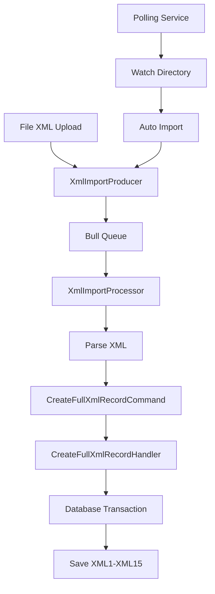

# 📋 Tài liệu Development - Import File XML QD3176

## 🎯 Tổng quan

Module `@bhxh/qd3176` cung cấp hệ thống import và xử lý file XML theo chuẩn Quyết định 3176/BYT-QĐ của Bộ Y tế. Hệ thống hỗ trợ 2 phương thức import:

1. **Upload trực tiếp qua API** - Xử lý đồng bộ
2. **Polling từ thư mục** - Xử lý bất đồng bộ tự động

## 🏗️ Kiến trúc hệ thống

### Cấu trúc thư mục
```
qd3176/
├── commands/                    # CQRS Commands
│   ├── create-full-xml-record.command.ts
│   ├── create-full-xml-record.handler.ts
│   ├── update-xml1s-by-key.command.ts
│   └── update-xml1s-by-key.handler.ts
├── queries/                     # CQRS Queries
│   ├── get-xml1s-by-keyword.query.ts
│   ├── get-xml1s-by-keyword.handler.ts
│   └── ...
├── entities/                    # Database Entities
│   ├── qd3176-xml1s.entity.ts
│   ├── qd3176-xml2s.entity.ts
│   └── ... (XML1-XML15)
├── repositories/                # Data Access Layer
│   ├── qd3176-xml1s.repository.ts
│   └── ...
├── services/                    # Business Logic
│   ├── xml-import.service.ts
│   └── xml-polling-import.service.ts
├── processors/                  # Background Job Processors
│   └── xml-import.processor.ts
├── producers/                   # Job Queue Producers
│   └── xml-import.producer.ts
├── utils/                       # Utility Functions
│   ├── snake-upper-to-camel.utils.ts
│   └── clean-pay-load.ts
└── constants/                   # Constants
    └── qd3176.constant.ts
```

### Luồng xử lý dữ liệu



## 🚀 Cách sử dụng

### 1. Import qua API Upload

#### Endpoint
```http
POST /admin/qd3176/upload
Content-Type: multipart/form-data

files: [File XML 1, File XML 2, ...]
```

#### Ví dụ sử dụng
```typescript
// Frontend - Upload multiple files
const formData = new FormData();
files.forEach(file => {
  formData.append('files', file);
});

const response = await fetch('/admin/qd3176/upload', {
  method: 'POST',
  body: formData,
  headers: {
    'Authorization': 'Bearer ' + token
  }
});

const result = await response.json();
console.log(result);
// {
//   success: true,
//   importSessionId: "uuid-here",
//   queued: 5,
//   jobIds: ["job1", "job2", ...]
// }
```

#### Controller Implementation
```typescript
@Post('upload')
@UseInterceptors(FilesInterceptor('files', 2000, {
  storage: multer.memoryStorage(),
  fileFilter: (req, file, cb) => {
    if (!file.originalname.match(/\.xml$/)) {
      return cb(
        new HttpException('Chỉ chấp nhận file XML', HttpStatus.BAD_REQUEST),
        false,
      );
    }
    cb(null, true);
  },
}))
async uploadXml(@UploadedFiles() files: Express.Multer.File[]) {
  const importSessionId = randomUUID();
  const { jobCount, jobIds } = await this.importProducer.enqueueFiles(files, importSessionId);
  return { success: true, importSessionId, queued: jobCount, jobIds };
}
```

### 2. Import tự động qua Polling

#### Cấu hình thư mục
```typescript
// xml-polling-import.service.ts
private readonly watchDir = './xml3176-folder';
private readonly processedDir = path.join(this.watchDir, 'processed');
private readonly errorDir = path.join(this.watchDir, 'errors');
private readonly intervalMs = 10000; // 10 giây
```

#### Cách sử dụng
1. Tạo thư mục `xml3176-folder` trong root project
2. Copy file XML vào thư mục này
3. Hệ thống tự động scan và import mỗi 10 giây
4. File thành công → chuyển vào `processed/`
5. File lỗi → chuyển vào `errors/`

## 🔧 Cấu hình và Setup

### 1. Cấu hình Bull Queue

```typescript
// qd3176.module.ts
@Module({
  imports: [
    BullModule.registerQueue({
      name: QD3176_XML_IMPORT_QUEUE.XML_IMPORT,
    }),
    // ...
  ],
  // ...
})
```

### 2. Cấu hình Database

```typescript
// entities/qd3176-xml1s.entity.ts
@Entity('QD3176_XML1S')
@Index(['maCskcb', 'maLk', 'stt'])
@Index(['maTheBhyt', 'ngayVao', 'thangQt', 'namQt', 'maLoaiKcb', 'maCskcb'])
export class Qd3176Xml1s extends BaseEntity {
  @Column({ name: 'MA_LK', length: 100 })
  @Index()
  maLk: string;
  
  // ... các trường khác
}
```

### 3. Cấu hình Redis (cho Bull Queue)

```typescript
// redis.config.ts
export const redisConfig = {
  host: process.env.REDIS_HOST || 'localhost',
  port: parseInt(process.env.REDIS_PORT) || 6379,
  password: process.env.REDIS_PASSWORD,
};
```

## 📊 Cấu trúc dữ liệu XML

### Các loại XML được hỗ trợ

| Loại | Mô tả | Entity |
|------|-------|--------|
| XML1 | Thông tin hồ sơ chính | Qd3176Xml1s |
| XML2 | Chi tiết thuốc | Qd3176Xml2s |
| XML3 | Dịch vụ kỹ thuật | Qd3176Xml3s |
| XML4 | Cận lâm sàng | Qd3176Xml4s |
| XML5 | Diễn biến bệnh | Qd3176Xml5s |
| XML6 | Phẫu thuật | Qd3176Xml6s |
| XML7 | Vận chuyển | Qd3176Xml7s |
| XML8 | Giường bệnh | Qd3176Xml8s |
| XML9 | Giấy chứng sinh | Qd3176Xml9s |
| XML10-XML15 | Các loại khác | Qd3176Xml10s-Qd3176Xml15s |

### Ví dụ cấu trúc XML

```xml
<?xml version="1.0" encoding="UTF-8"?>
<GIAMDINHHS>
  <THONGTINHOSO>
    <DANHSACHHOSO>
      <HOSO>
        <FILEHOSO>
          <LOAIHOSO>XML1</LOAIHOSO>
          <NOIDUNGFILE>base64-encoded-xml-content</NOIDUNGFILE>
        </FILEHOSO>
        <FILEHOSO>
          <LOAIHOSO>XML2</LOAIHOSO>
          <NOIDUNGFILE>base64-encoded-xml-content</NOIDUNGFILE>
        </FILEHOSO>
        <!-- ... các FILEHOSO khác -->
      </HOSO>
    </DANHSACHHOSO>
  </THONGTINHOSO>
</GIAMDINHHS>
```

## ⚙️ Xử lý dữ liệu

### 1. Parse XML và chuyển đổi

```typescript
// xml-import.service.ts
async processXmlFiles(files: Express.Multer.File[], importSessionId: string) {
  for (const file of files) {
    // Parse XML gốc
    const xml = await parseStringPromise(file.buffer.toString('utf8'), { 
      explicitArray: false 
    });

    // Lấy danh sách FILEHOSO
    const fileXmlsRaw = xml.GIAMDINHHS?.THONGTINHOSO?.DANHSACHHOSO?.HOSO?.FILEHOSO;
    const fileXmls = Array.isArray(fileXmlsRaw) ? fileXmlsRaw : [fileXmlsRaw];

    // Xử lý từng FILEHOSO
    for (const fileXml of fileXmls) {
      const type = fileXml.LOAIHOSO;
      const base64 = fileXml.NOIDUNGFILE;
      const decoded = Buffer.from(base64, 'base64').toString('utf-8');
      
      // Parse XML con
      const parsed = await parseStringPromise(decoded, { explicitArray: false });
      const rootKey = Object.keys(parsed)[0];
      
      // Chuyển đổi snake_case sang camelCase
      const normalized = snakeUpperToCamel(parsed[rootKey]);
      filePayloads[type] = normalized;
    }
  }
}
```

### 2. Chuyển đổi naming convention

```typescript
// utils/snake-upper-to-camel.utils.ts
export function snakeUpperToCamel(input: Record<string, any>): Record<string, any> {
  const result: Record<string, any> = {};

  for (const key in input) {
    const words = key.split('_');
    const camelKey = words
      .map((word, index) => {
        word = word.toLowerCase();
        return index === 0 ? word : word.charAt(0).toUpperCase() + word.slice(1);
      })
      .join('');

    result[camelKey] = input[key];
  }

  return result;
}

// Ví dụ: MA_THE_BHYT → maTheBhyt
```

### 3. Lưu trữ dữ liệu

```typescript
// commands/create-full-xml-record.handler.ts
async execute(command: CreateFullXmlRecordCommand) {
  return await this.dataSource.transaction(async manager => {
    // 1. Lưu XML1 (hồ sơ chính)
    const savedXml1 = await manager.getRepository(Qd3176Xml1s).save(
      manager.getRepository(Qd3176Xml1s).create({
        ...cleanPayload(xmlPayloads.XML1), 
        importSessionId: command.importSessionId
      })
    );
    
    const xml1Id = savedXml1.id;

    // 2. Lưu XML2-XML15 với xml1Id
    for (const key of Object.keys(xmlPayloads)) {
      if (key === QD3176_XML_TYPE.XML1) continue;
      
      const rawData = xmlPayloads[key];
      
      switch (key) {
        case QD3176_XML_TYPE.XML2:
          // Xử lý danh sách thuốc
          const chiTietThuoc = rawData.dsachChiTietThuoc?.CHI_TIET_THUOC;
          const chiTietThuocItems = Array.isArray(chiTietThuoc) ? 
            chiTietThuoc : chiTietThuoc ? [chiTietThuoc] : [];
          
          for (const item of chiTietThuocItems) {
            const normalizedItem = snakeUpperToCamel(cleanPayload(item));
            await manager.getRepository(Qd3176Xml2s).save({ 
              ...normalizedItem, 
              xml1Id
            });
          }
          break;
        // ... xử lý các loại XML khác
      }
    }
  });
}
```

## 🔄 Background Processing

### 1. Producer - Tạo job

```typescript
// producers/xml-import.producer.ts
async enqueueFiles(files: Express.Multer.File[], importSessionId: string) {
  const baseDir = path.join('/tmp', 'qd3176-import', importSessionId);
  this.ensureDir(baseDir);

  const jobIds: string[] = [];
  for (const f of files) {
    const fileId = randomUUID();
    const diskPath = path.join(baseDir, `${fileId}__${f.originalname}`);
    fs.writeFileSync(diskPath, f.buffer);

    const job = await this.queue.add(
      'parse-and-create',
      { diskPath, originalName: f.originalname, importSessionId },
      {
        jobId: `${importSessionId}:${fileId}`,
        attempts: 3,
        backoff: { type: 'exponential', delay: 3000 },
        removeOnComplete: 1000,
        removeOnFail: 5000,
        priority: 5,
      },
    );
    jobIds.push(String(job.id));
  }
  
  return { jobCount: files.length, jobIds };
}
```

### 2. Processor - Xử lý job

```typescript
// processors/xml-import.processor.ts
@Process({ name: 'parse-and-create', concurrency: 12 })
async handle(job: Job<{ diskPath: string; originalName: string; importSessionId: string }>) {
  const { diskPath, originalName, importSessionId } = job.data;

  try {
    // Đọc file từ disk
    const content = await fs.readFile(diskPath, 'utf8');
    const xml = await parseStringPromise(content, { explicitArray: false });
    
    // Validate XML
    if (!xml?.GIAMDINHHS) {
      throw new BadRequestException('INVALID_XML_3176_FILE');
    }

    // Xử lý dữ liệu
    const filePayloads: Record<string, any> = {};
    // ... logic xử lý

    // Lưu vào database
    const result = await this.commandBus.execute(
      new CreateFullXmlRecordCommand(filePayloads, importSessionId)
    );
    
    await job.progress(100);
    return { fileName: originalName, result };
  } catch (err) {
    this.logger.error(`Job failed: ${err?.message || err}`);
    throw err;
  } finally {
    // Cleanup file
    try { 
      await fs.unlink(diskPath); 
    } catch {}
  }
}
```

## 🛡️ Error Handling và Validation

### 1. File Validation

```typescript
// Controller validation
fileFilter: (req, file, cb) => {
  if (!file.originalname.match(/\.xml$/)) {
    return cb(
      new HttpException('Chỉ chấp nhận file XML', HttpStatus.BAD_REQUEST),
      false,
    );
  }
  cb(null, true);
}
```

### 2. XML Structure Validation

```typescript
// Processor validation
if (!xml?.GIAMDINHHS) {
  throw new BadRequestException('INVALID_XML_3176_FILE');
}

if (!fileXmlsRaw) {
  this.logger.warn(`No FILEHOSO in ${originalName}`);
}
```

### 3. Database Error Handling

```typescript
// Command handler
try {
  const savedXml2 = await manager.getRepository(Qd3176Xml2s).save({ 
    ...normalizedItem, 
    xml1Id
  });
} catch (error) {
  this.logger.error(`Error saving XML2: ${error}`);
  // Continue processing other records
}
```

## 📈 Monitoring và Logging

### 1. Job Progress Tracking

```typescript
// Processor progress
await job.progress(Math.round((i / totalParts) * 80)); // 0–80%
// ... processing
await job.progress(100);
```

### 2. Logging

```typescript
// Success logging
this.logger.log(`Successfully processed ${originalName} (session=${importSessionId}, job=${job.id})`);

// Error logging
this.logger.error(`Job failed (session=${importSessionId}, job=${job.id}, file=${originalName}): ${err?.message || err}`);
```

### 3. Polling Service Logging

```typescript
// File processing status
this.logger.log(`✅ Import thành công: ${fileName}`);
this.logger.error(`❌ Lỗi khi xử lý ${fileName}: ${err.message}`);
this.logger.warn(`🔒 Đang bị khóa: ${path.basename(lockFile)}`);
```

## 🚀 Performance Optimization

### 1. Database Indexing

```typescript
// Entity indexing
@Index(['maCskcb', 'maLk', 'stt'])
@Index(['maTheBhyt', 'ngayVao', 'thangQt', 'namQt', 'maLoaiKcb', 'maCskcb'])
@Index(['soCccd'])
@Index(['maTheBhyt'])
```

### 2. Concurrency Control

```typescript
// Processor concurrency
@Process({ name: 'parse-and-create', concurrency: 12 })

// Polling service lock
private isRunning = false;
if (this.isRunning) return; // tránh chạy trùng
```

### 3. Memory Management

```typescript
// File cleanup
finally {
  try { 
    await fs.unlink(diskPath); 
  } catch {}
}

// Job cleanup
removeOnComplete: 1000,
removeOnFail: 5000,
```

## 🔧 Troubleshooting

### 1. Common Issues

#### File không được import
- Kiểm tra định dạng file (.xml)
- Kiểm tra cấu trúc XML có đúng chuẩn QD3176
- Kiểm tra log để xem lỗi cụ thể

#### Job bị stuck
- Kiểm tra Redis connection
- Kiểm tra database connection
- Restart Bull queue

#### Polling không hoạt động
- Kiểm tra quyền truy cập thư mục
- Kiểm tra file lock (.lock files)
- Kiểm tra log của XmlPollingImportService

### 2. Debug Commands

```bash
# Kiểm tra Redis
redis-cli ping

# Kiểm tra Bull queue
redis-cli keys "*bull*"

# Kiểm tra log
tail -f logs/combined.log | grep "XmlImport"
```

## 📝 Best Practices

### 1. File Upload
- Giới hạn số lượng file (2000 files max)
- Validate file type trước khi xử lý
- Sử dụng unique import session ID

### 2. Data Processing
- Sử dụng database transaction
- Implement retry mechanism
- Log chi tiết cho debugging

### 3. Error Handling
- Graceful error handling
- Continue processing khi có lỗi
- Cleanup resources sau khi xử lý

### 4. Performance
- Sử dụng background processing
- Implement concurrency control
- Optimize database queries với index

## 🔮 Future Enhancements

### 1. Tính năng có thể thêm
- Webhook notification khi import hoàn thành
- Dashboard monitoring import status
- Batch import với progress bar
- Export dữ liệu đã import

### 2. Cải thiện performance
- Streaming XML parser cho file lớn
- Parallel processing cho multiple files
- Caching cho frequently accessed data

### 3. Security
- File size validation
- XML content validation
- Rate limiting cho upload endpoint

---

## 📞 Support

Nếu gặp vấn đề trong quá trình development, vui lòng:

1. Kiểm tra log files trong thư mục `logs/`
2. Xem error messages trong console
3. Kiểm tra database connection và Redis
4. Liên hệ team development để được hỗ trợ

**Tài liệu này được cập nhật thường xuyên. Vui lòng kiểm tra phiên bản mới nhất.**
