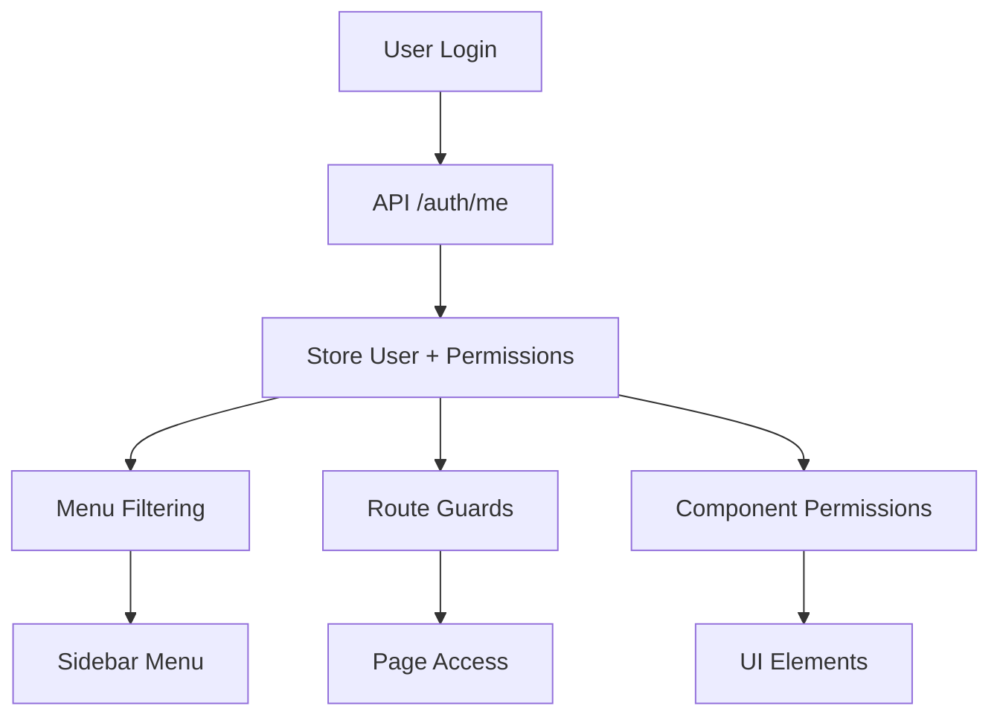

# Tài liệu Hệ thống Phân quyền - BM Patient Hub

## 📋 Tổng quan

Hệ thống phân quyền của BM Patient Hub được thiết kế để kiểm soát quyền truy cập vào các chức năng và menu dựa trên permissions từ API backend. Hệ thống sử dụng JWT token để xác thực và quản lý permissions thông qua Vue 3 Composition API, Pinia store, và custom directives.

## 🏗️ Kiến trúc Hệ thống

### 1. Cấu trúc Thư mục
```
frontend/src/
├── composables/
│   └── usePermissions.ts          # Composable để sử dụng permissions
├── directives/
│   └── permission.directive.ts    # Directive v-permission
├── stores/
│   └── auth.store.ts             # Pinia store quản lý auth & permissions
├── utils/
│   ├── permission.utils.ts       # Utility functions cho permissions
│   └── PERMISSION_GUIDE.md       # Hướng dẫn sử dụng
├── data/
│   └── menu.ts                   # Cấu hình menu với permissions
└── models/
    └── user.model.ts             # Interface User với permissions
```

### 2. Luồng Xử lý Permissions


## 🔐 Cấu trúc Permissions

### 1. Định nghĩa Permissions

Hệ thống sử dụng 2 loại permissions:

#### **CRUD Permissions** (Chức năng)
- `{module}:create` - Tạo mới
- `{module}:read` - Xem/Đọc
- `{module}:update` - Cập nhật
- `{module}:delete` - Xóa

#### **Menu Access Permissions** (Truy cập menu)
- `access_menu_{module}` - Quyền truy cập menu module

### 2. Danh sách Modules hiện tại

```typescript
// Các modules được hỗ trợ
const MODULES = {
  NOTIFICATION: 'notification',
  SURVEY: 'survey', 
  USER: 'user',
  QUEUE: 'queue',
  APPOINTMENT: 'appointment',
  MEILISEARCH: 'meilisearch'
}
```

### 3. Ví dụ Permissions từ API

```json
{
  "data": {
    "userId": 14874,
    "username": "tracnn",
    "fullName": "Nguyễn Ngọc Trác",
    "email": "tracnn20021979@gmail.com",
    "phoneNumber": "0988795445",
    "permissions": [
      // Notification permissions
      "notification:create",
      "notification:read", 
      "notification:update",
      "notification:delete",
      "access_menu_notification",
      
      // Survey permissions
      "survey:create",
      "survey:update",
      "survey:delete", 
      "survey:read",
      "access_menu_survey",
      
      // User permissions
      "user:create",
      "user:update",
      "user:delete",
      "user:read", 
      "access_menu_user",
      
      // Queue permissions
      "queue:create",
      "queue:update",
      "queue:delete",
      "queue:read",
      "access_menu_queue",
      
      // Appointment permissions
      "appointment:create",
      "appointment:update", 
      "appointment:delete",
      "appointment:read",
      "access_menu_appointment",
      
      // Meilisearch permissions
      "meilisearch:delete",
      "meilisearch:read",
      "meilisearch:update", 
      "meilisearch:create",
      "access_menu_meilisearch"
    ]
  }
}
```

## 🎯 Mapping Menu với Permissions

### 1. Cấu trúc Menu hiện tại

```typescript
// data/menu.ts
const menuData = {
  main: [
    {
      name: "Dashboard",
      to: "backend-dashboard",        // Không cần permission
      icon: "si si-speedometer",
    },
    {
      name: "Quản lý App bệnh nhân",
      icon: "si si-calendar",
      sub: [
        {
          name: "Danh mục",
          sub: [
            {
              name: "Chuyên khoa",
              to: "backend-specialties",        // Cần: access_menu_appointment
            },
            {
              name: "Chức danh", 
              to: "backend-title",              // Cần: access_menu_appointment
            },
            {
              name: "Chức danh - Bác sĩ",
              to: "backend-doctor-title",       // Cần: access_menu_appointment
            },
            {
              name: "PK - Chuyên khoa",
              to: "backend-clinic-specialty",   // Cần: access_menu_appointment
            },
            {
              name: "Người dùng",
              to: "backend-users",              // Cần: access_menu_user
            },
          ]
        },
        {
          name: "Quản lý lịch khám",
          to: "backend-appointment-slots",      // Cần: access_menu_appointment
        },
        {
          name: "Quản lý BN đặt lịch", 
          to: "backend-appointment-management", // Cần: access_menu_appointment
        },
        {
          name: "Import lịch khám (Excel)",
          to: "backend-import-appointment-slots", // Cần: access_menu_appointment
        },
      ],
    },
    {
      name: "Quản lý xếp hàng",
      icon: "si si-calendar", 
      sub: [
        {
          name: "Danh mục",
          sub: [
            {
              name: "Phòng xếp số",
              to: "backend-queue-room",         // Cần: access_menu_queue
            },
            {
              name: "Phòng xếp số - Thực hiện",
              to: "backend-queue-clinic-room",  // Cần: access_menu_queue
            },
          ]
        },
        {
          name: "Quản lý xếp hàng",
          to: "backend-queue-ticket",           // Cần: access_menu_queue
        }
      ],
    },
    {
      name: "Khảo sát hài lòng",
      to: "backend-satisfaction-survey",        // Cần: access_menu_survey
      icon: "si si-star",
    },
  ],
}
```

### 2. Menu Permission Mapping

```typescript
// utils/permission.utils.ts
export const MENU_PERMISSIONS = {
  'backend-dashboard': [], // Dashboard không cần permission đặc biệt
  'backend-specialties': [PERMISSIONS.ACCESS_MENU_APPOINTMENT],
  'backend-title': [PERMISSIONS.ACCESS_MENU_APPOINTMENT],
  'backend-users': [PERMISSIONS.ACCESS_MENU_USER],
  'backend-doctor-title': [PERMISSIONS.ACCESS_MENU_APPOINTMENT],
  'backend-clinic-specialty': [PERMISSIONS.ACCESS_MENU_APPOINTMENT],
  'backend-appointment-slots': [PERMISSIONS.ACCESS_MENU_APPOINTMENT],
  'backend-import-appointment-slots': [PERMISSIONS.ACCESS_MENU_APPOINTMENT],
  'backend-appointment-management': [PERMISSIONS.ACCESS_MENU_APPOINTMENT],
  'backend-queue-room': [PERMISSIONS.ACCESS_MENU_QUEUE],
  'backend-queue-clinic-room': [PERMISSIONS.ACCESS_MENU_QUEUE],
  'backend-queue-ticket': [PERMISSIONS.ACCESS_MENU_QUEUE],
  'backend-satisfaction-survey': [PERMISSIONS.ACCESS_MENU_SURVEY],
} as const;
```

## 🛠️ Cách Sử dụng

### 1. Trong Components với Composable

```vue
<script setup lang="ts">
import { usePermissions } from '@/composables/usePermissions';

const { 
  user, 
  permissions, 
  isAuthenticated,
  hasPermission, 
  hasAnyPermission, 
  hasAllPermissions,
  canAccessRoute,
  isAdmin 
} = usePermissions();

// Kiểm tra single permission
const canCreateUser = hasPermission('user:create');
const canReadUsers = hasPermission('user:read');

// Kiểm tra multiple permissions (có ít nhất 1)
const canManageUsers = hasAnyPermission(['user:create', 'user:update', 'user:delete']);

// Kiểm tra tất cả permissions
const isFullAdmin = hasAllPermissions(['user:create', 'user:update', 'user:delete', 'user:read']);

// Kiểm tra quyền truy cập route
const canAccessUserPage = canAccessRoute('backend-users');

// Kiểm tra admin
const isUserAdmin = isAdmin();
</script>

<template>
  <div>
    <!-- Hiển thị nút tạo user nếu có quyền -->
    <button v-if="canCreateUser" @click="createUser">
      Tạo người dùng mới
    </button>
    
    <!-- Hiển thị danh sách user nếu có quyền đọc -->
    <div v-if="canReadUsers">
      <UserList />
    </div>
    
    <!-- Hiển thị menu quản lý nếu có ít nhất 1 quyền -->
    <div v-if="canManageUsers">
      <UserManagementMenu />
    </div>
  </div>
</template>
```

### 2. Trong Template với Directive

```vue
<template>
  <!-- Single permission -->
  <button v-permission="'user:create'">Tạo người dùng</button>
  <button v-permission="'user:delete'">Xóa người dùng</button>

  <!-- Multiple permissions (có ít nhất 1) -->
  <button v-permission="['user:create', 'user:update']">
    Quản lý người dùng
  </button>

  <!-- Object với mode -->
  <button v-permission="{ 
    permissions: ['user:create', 'user:update'], 
    mode: 'all' 
  }">
    Quyền đầy đủ
  </button>
  
  <!-- Menu items -->
  <nav v-permission="'access_menu_user'">
    <a href="/users">Quản lý người dùng</a>
  </nav>
</template>
```

### 3. Trong Router Guards

```typescript
// router/index.ts
import { useAuthStore } from '@/stores/auth.store';
import PermissionUtils from '@/utils/permission.utils';

const router = createRouter({
  // ... routes
});

router.beforeEach((to, from, next) => {
  const authStore = useAuthStore();
  
  // Kiểm tra authentication
  if (to.meta.requiresAuth && !authStore.getIsAuthenticated) {
    next('/auth/signin');
    return;
  }
  
  // Kiểm tra permission
  if (to.meta.requiresPermission) {
    const hasPermission = PermissionUtils.hasPermission(to.meta.requiresPermission);
    if (!hasPermission) {
      next('/errors/403'); // Chuyển đến trang 403
      return;
    }
  }
  
  // Kiểm tra route access
  if (!PermissionUtils.canAccessRoute(to.name as string)) {
    next('/errors/403');
    return;
  }
  
  next();
});
```

### 4. Trong Menu Component

```vue
<script setup lang="ts">
import { computed } from 'vue';
import { usePermissions } from '@/composables/usePermissions';
import menuData from '@/data/menu.ts';
import PermissionUtils from '@/utils/permission.utils';

const { canAccessRoute } = usePermissions();

// Lọc menu dựa trên permissions
const filteredMenu = computed(() => {
  return PermissionUtils.filterMenuByPermissions(menuData.main);
});
</script>

<template>
  <nav>
    <ul v-for="item in filteredMenu" :key="item.name">
      <li>
        <router-link 
          v-if="item.to" 
          :to="{ name: item.to }"
          :class="{ active: $route.name === item.to }"
        >
          <i :class="item.icon"></i>
          {{ item.name }}
        </router-link>
        
        <!-- Sub menu -->
        <ul v-if="item.sub" class="sub-menu">
          <li v-for="subItem in item.sub" :key="subItem.name">
            <router-link 
              v-if="subItem.to" 
              :to="{ name: subItem.to }"
            >
              {{ subItem.name }}
            </router-link>
          </li>
        </ul>
      </li>
    </ul>
  </nav>
</template>
```

## 🔧 API Integration

### 1. Endpoint lấy thông tin user và permissions

```bash
curl -X 'GET' \
  'http://localhost:7111/admin/auth/me' \
  -H 'accept: */*' \
  -H 'Authorization: Bearer {JWT_TOKEN}'
```

### 2. Response Format

```json
{
  "data": {
    "userId": 14874,
    "username": "tracnn",
    "fullName": "Nguyễn Ngọc Trác", 
    "email": "tracnn20021979@gmail.com",
    "phoneNumber": "0988795445",
    "permissions": [
      "notification:create",
      "notification:read",
      "notification:update", 
      "notification:delete",
      "access_menu_notification",
      "survey:create",
      "survey:update",
      "survey:delete",
      "survey:read",
      "access_menu_survey",
      "user:create",
      "user:update",
      "user:delete",
      "user:read",
      "access_menu_user",
      "queue:create",
      "queue:update",
      "queue:delete", 
      "queue:read",
      "access_menu_queue",
      "appointment:create",
      "appointment:update",
      "appointment:delete",
      "appointment:read",
      "access_menu_appointment",
      "meilisearch:delete",
      "meilisearch:read",
      "meilisearch:update",
      "meilisearch:create",
      "access_menu_meilisearch"
    ]
  },
  "pagination": null,
  "status": 200,
  "message": "Success",
  "now": "2025-09-12 07:29:06.830"
}
```

### 3. Auth Store Integration

```typescript
// stores/auth.store.ts
export const useAuthStore = defineStore('auth', {
  state: () => ({
    user: null,
    isAuthenticated: false,
    // ...
  }),

  actions: {
    async checkAuth(): Promise<boolean> {
      try {
        const user = await authService.getCurrentUser();
        this.setUser(user); // user.permissions được lưu vào store
        return true;
      } catch (error) {
        this.logout();
        return false;
      }
    },
    
    setUser(user: User | null): void {
      this.user = user;
      this.isAuthenticated = !!user;
    }
  }
});
```

## 📝 Thêm Permission Mới

### 1. Thêm Permission Constants

```typescript
// utils/permission.utils.ts
export const PERMISSIONS = {
  // ... existing permissions
  
  // New module permissions
  NEW_MODULE_CREATE: 'new_module:create',
  NEW_MODULE_READ: 'new_module:read', 
  NEW_MODULE_UPDATE: 'new_module:update',
  NEW_MODULE_DELETE: 'new_module:delete',
  ACCESS_MENU_NEW_MODULE: 'access_menu_new_module',
} as const;
```

### 2. Thêm Menu Permission Mapping

```typescript
export const MENU_PERMISSIONS = {
  // ... existing mappings
  
  'backend-new-module': [PERMISSIONS.ACCESS_MENU_NEW_MODULE],
  'backend-new-module-list': [PERMISSIONS.ACCESS_MENU_NEW_MODULE],
  'backend-new-module-create': [PERMISSIONS.ACCESS_MENU_NEW_MODULE],
} as const;
```

### 3. Thêm Route với Permission

```typescript
// router/index.ts
{
  path: "new-module",
  name: "backend-new-module",
  component: NewModuleComponent,
  meta: { 
    layout: LayoutBackend,
    requiresAuth: true,
    requiresPermission: "access_menu_new_module"
  },
}
```

### 4. Cập nhật Menu Data

```typescript
// data/menu.ts
{
  name: "Module Mới",
  to: "backend-new-module",
  icon: "si si-puzzle",
}
```

## 🚨 Error Handling

### 1. Route Access Denied

```typescript
// Khi user không có quyền truy cập route
if (!PermissionUtils.canAccessRoute(routeName)) {
  // Chuyển đến trang 403
  router.push('/errors/403');
}
```

### 2. Menu Item Hidden

```typescript
// Menu items tự động bị ẩn nếu user không có quyền
const filteredMenu = PermissionUtils.filterMenuByPermissions(menuItems);
// Chỉ hiển thị items mà user có quyền
```

### 3. UI Element Hidden

```vue
<!-- Element tự động bị ẩn với directive -->
<button v-permission="'user:delete'">Xóa</button>
<!-- Nếu không có quyền, button sẽ bị ẩn -->
```

## 🧪 Testing

### 1. Unit Tests

```typescript
// tests/permission.utils.test.ts
import PermissionUtils from '@/utils/permission.utils';

describe('PermissionUtils', () => {
  beforeEach(() => {
    // Mock user với permissions
    const mockUser = {
      permissions: ['user:read', 'user:create', 'access_menu_user']
    };
    // Set mock user vào store
  });

  test('should check single permission', () => {
    expect(PermissionUtils.hasPermission('user:read')).toBe(true);
    expect(PermissionUtils.hasPermission('user:delete')).toBe(false);
  });

  test('should check multiple permissions', () => {
    expect(PermissionUtils.hasAnyPermission(['user:read', 'user:delete'])).toBe(true);
    expect(PermissionUtils.hasAllPermissions(['user:read', 'user:create'])).toBe(true);
  });

  test('should check route access', () => {
    expect(PermissionUtils.canAccessRoute('backend-users')).toBe(true);
    expect(PermissionUtils.canAccessRoute('backend-admin')).toBe(false);
  });
});
```

### 2. Component Tests

```typescript
// tests/UserManagement.test.ts
import { mount } from '@vue/test-utils';
import UserManagement from '@/components/UserManagement.vue';
import { usePermissions } from '@/composables/usePermissions';

test('should show create button when user has permission', () => {
  // Mock permissions
  vi.mocked(usePermissions).mockReturnValue({
    hasPermission: vi.fn().mockReturnValue(true)
  });

  const wrapper = mount(UserManagement);
  expect(wrapper.find('[data-test="create-button"]').exists()).toBe(true);
});
```

## 📊 Monitoring & Debugging

### 1. Debug Permissions

```typescript
// Trong component
const { permissions, user } = usePermissions();

// Log permissions để debug
console.log('User permissions:', permissions.value);
console.log('User info:', user.value);
```

### 2. Permission Check Logging

```typescript
// utils/permission.utils.ts
static hasPermission(permission: string): boolean {
  const authStore = useAuthStore();
  const user = authStore.getUser;
  
  const hasPermission = user?.permissions?.includes(permission) || false;
  
  // Debug logging
  if (process.env.NODE_ENV === 'development') {
    console.log(`Permission check: ${permission} = ${hasPermission}`);
  }
  
  return hasPermission;
}
```

## 🔒 Security Best Practices

### 1. Frontend Security

- **Không tin tưởng hoàn toàn vào frontend**: Frontend chỉ để UX, backend phải validate permissions
- **JWT Token Security**: Token được lưu trong localStorage, có expiration time
- **Route Guards**: Tất cả protected routes đều có guards
- **Menu Filtering**: Menu được filter dựa trên permissions thực tế

### 2. Backend Integration

- **API Validation**: Mọi API call đều phải validate permissions ở backend
- **Token Refresh**: Tự động refresh token khi gần hết hạn
- **Error Handling**: Xử lý lỗi 401/403 một cách graceful

## 📚 Tài liệu Tham khảo

- [Vue 3 Composition API](https://vuejs.org/guide/composition-api/)
- [Pinia Store](https://pinia.vuejs.org/)
- [Vue Router Guards](https://router.vuejs.org/guide/advanced/navigation-guards.html)
- [JWT Token](https://jwt.io/)
- [Vue 3 Directives](https://vuejs.org/guide/reusability/custom-directives.html)

---

**Lưu ý**: Tài liệu này được cập nhật theo cấu trúc hiện tại của project. Khi có thay đổi về permissions hoặc modules mới, cần cập nhật tài liệu tương ứng.
